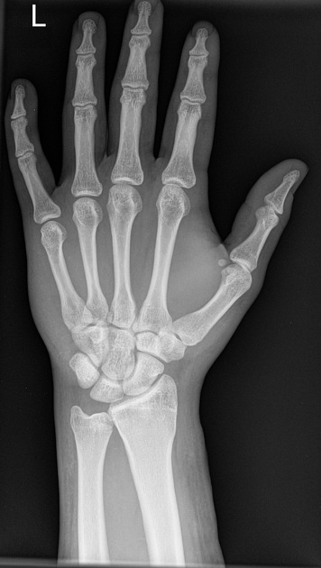
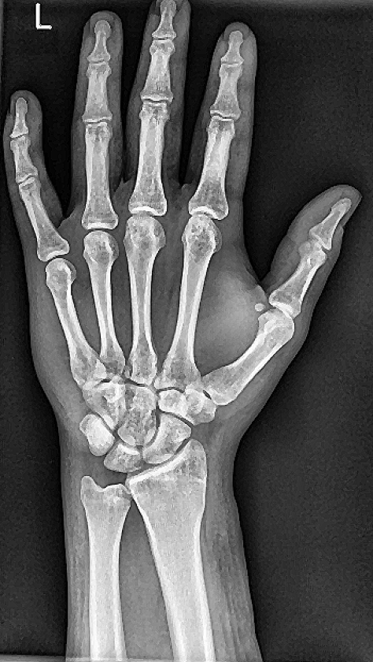

# 🏥 Medical Image Enhancement System

## 📌 Overview
A Python-based medical image enhancement system designed to improve the visual quality of X-ray and MRI images using advanced image processing techniques.

## 🔬 Processing Pipeline

Original → Median Filter → CLAHE → Sharpening

## 🚀 Features

- Upload medical images from device
- Noise reduction using Median Filter
- Contrast enhancement using CLAHE
- Image sharpening for better clarity
- Before vs After comparison visualization

## 🛠 Technologies Used

- Python
- OpenCV
- NumPy
- Matplotlib
- Tkinter

## 🎯 Applications

- Medical image preprocessing
- Diagnostic assistance
- Research and academic projects
- Biomedical image enhancement studies

## ▶ How to Run

1. Install dependencies:
  pip install -r requirements.txt
2. Run the program:
  python main.py
3. Select a medical image from your device.

## 📷 Sample Output

 | Input | Output |
|-------|--------|
|  |  |

---
